# 项目介绍
随着物联网技术、云计算和大数据技术的发展,智慧生活已经成为人们生活的重要组成部分。然而,传统的智能数据计算依赖于云服务,存在响应速度慢、能耗高等问题。为了解决这些问题,基于边缘计算的设备应运而生，它是介于用户端和云服务器之间的中间层,可以实现数据的高速处理、低延迟响应和端到端的快速对接。本文主要介绍以边缘计算网关为主体，设计出适于多数小型个人的智能家居体系。

# 环境依赖
Python: Python 3.8

# 目录结构描述
    ├── Device Unit code

    │   ├── example_airconditioner_unit

    │           └── esp8266_airconditioner_unnit.ino

    │   ├── example_curtain_unit

    │           └── esp8266_curtain_unit

    │   └── example_doorsecurity_unit

    │           └── esp8266_doorsecurity_unit

    ├── Edge Gate code

    │   ├── Database Server

    │           ├── database_process_server.py

    │           └── serverConfig.txt

    │   ├── Gate

    │           ├── GateConfig.txt

    │           ├── UserConfig.txt

    │           ├── gate.py

    │           └── gateLogs.log

    │   ├── __pycache__

    │           └── MyComm.cpython-39.pyc

    │   └── MyComm.py

    ├── IoT APP code.rar

    └── README.md

# 使用说明
## 系统概要
系统的体系架构分为三部分：设备硬件层、物联网网关层、应用接口层。
### 设备硬件层
设备硬件层由各个硬件设备节点通过Wi-Fi互联组成，主要负责用户硬件层的访问控制、传感数据获取、控制数据向控制器的分配、数据上传至网关等任务。

它以具备Wi-Fi通信能力的ESP8266 NodeMCU主控板作为基础，将不同类型的传感器分组并连接在主控板上，构成同时具备较低功耗的和较短距离采集、控制和通信能力的节点单元，用于模拟实际场景的家居设备。
### 物联网网关层
物联网网关层是体系结构的主体，由具备高兼容性的Python语言编写。物联网网关基于Windows操作系统，主要负责多设备异构网络接入、数据处理、数据上下行、数据存储、访问控制及日志记录等一系列核心功能。
### 应用接口层
应用接口层主要面向个人用户和开发厂商，提供丰富的用户接口。用户可以通过注册登录进入图形化操作界面，查看家庭各种传感器的实时数据或历史数据、设定自动化任务、远程控制家居设备等功能。同时，应用接口层还支持开发厂商进行系统扩展和升级，以满足不同的业务需求。

## 系统总体架构
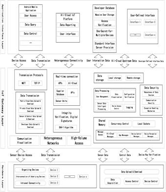

## 系统拓扑
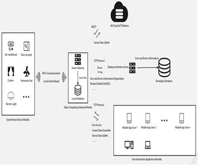

## 设备节点
### 关于设备节点
设备节点指的是每个个人用户所属的单个设备，比如智能空调设备、火灾报警设备、雨量监测设备等。设备节点由ESP8266（通信元件）、传感元件和控制元件组成。

### 硬件层访问控制方法
各个射频识别设备和其他设备节点同样在发行前会与用户进行绑定，即用户和射频卡片是唯一对应的。在个人网关启动后，网关会阻塞式等待门禁通过，期间连入的传感器都会进入等待状态，直到用户门禁通过后才会与网关开始收发通信。

### 设备节点控制流程
设备节点本身不具有产生控制数据的能力，仅暂存自身获得的传感数据，因此一切控制数据的计算和处理在智能网关处完成。

设备控制数据的核心在于阈值的设置，即当设备传出的传感数据大于或者小于用户设定的阈值时，设备节点将控制对应的控制元件做出反应，实现智能设备的控制，阈值的处理在智能网关部分。

设备节点的工作流程主要分为两个部分：发送线程和接收线程。发送线程用于将传感单元获得的感知数据发送给网关，而接收线程用于接收从网关部分获得的控制数据，并操作控制元件。

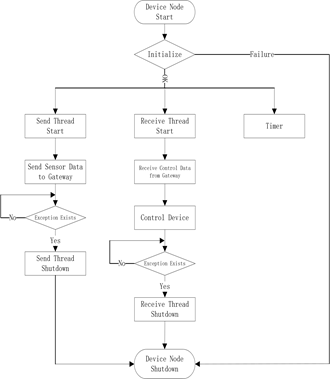

## 边缘计算网关
### 边缘计算网关处理流程
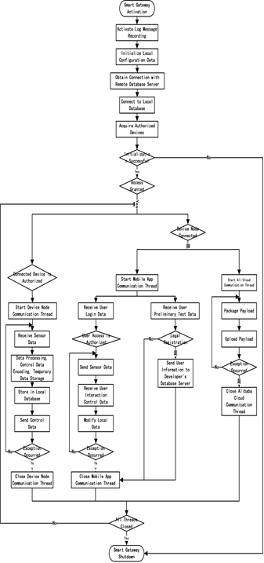

### 网关本地数据库示例
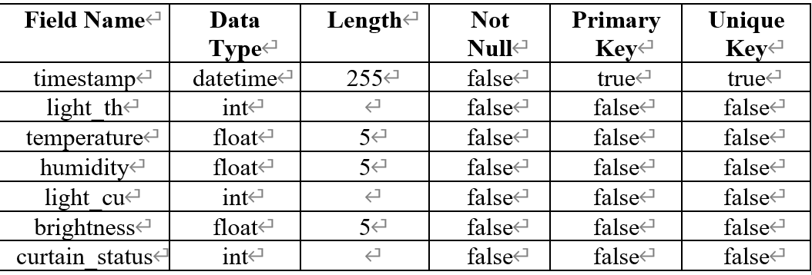

### 通信
#### 通信格式示例
##### JSON
设备节点的通信单元格式：设备名与节点数据的组合。

设备名（device id）唯一标识某一设备，在设备生产时分配。

设备节点对应功能的传感数据，如智能空调返回温湿度、空调开闭情况等数据。

示例：{"device_id": "name", "data 1":"a", "data 2":"b",…, "data n":"x"}，表示连入的设备节点名为name，返回设备节点信息有n条，分别是a、b、…、x。

##### 自定义类型
自定义通信单元格式："操作部分|数据部分|状态部分" ，通信单元分隔符"|"。

操作部分（operation region）：用于定义接收设备应当执行的操作。

数据部分（data region）：用于存储在某一操作下所必须的数据，空设置为NULL。

状态部分（status region）：用于告知接收设备本次或上一次操作的状态，一般为0或者1。

示例：网关向服务器：add_new_user | {UserDetail} | 1，表示用户正在注册，需要存储新用户，状态正常。

#### 自定义操作格式示例
##### 网关与数据库服务器
check_device_id	-            网关获取设备节点访问控制列表	   -         返回设备密钥对应的设备列表

add_new_user	  -          网关将用户新注册用户信息存入数据库服务器	- 无，操作成功或者失败

check_userconfig_illegal-	网关校验本地配置是否合法               -     无，或者正确的配置信息

##### 网关向移动应用程序
login	            -            安卓登录	  -  操作成功或者失败

register	       -             安卓新用户注册	- 操作成功或者失败

light_th_open	     -           开启智能空调-	 无，改变温湿度阈值

light_th_close         -     	关闭智能空调	- 无，改变温湿度阈值

change_temperature_threshold	-改变温度阈值-	 无，改变温度阈值

change_humidity_threshold	-    改变湿度阈值-	 无，改变湿度阈值

curtain_close	       -         关闭窗帘	   - 无，改变光照度阈值

curtain_open	        -        开启窗帘	 -   无，改变光照度阈值

change_brightness_threshold	 -   改变光照度阈值	- 无，改变光照度阈值 

#### 网关层设备访问控制方法
用户注册时会录入自己的设备密钥，智能网关会在初始化时根据设备密钥，从开发商数据库获得与设备密钥对应的设备列表，即实现“一人一密多机”的访问控制机制。

当设备节点连入网关，会发送自身设备唯一识别码（device id），此时网关将会在暂存的设备列表中查找，若该设备id存在，则开启与该设备节点的收发通信线程，反之，则拒绝连接。

#### 用户访问控制方法
网关本地存储有合法用户信息，用户可以通过移动应用程序登录并开启通信。若网关不存在用户信息，则需要注册来初始化信息。

注册用户的要求如下：

a. 用户名在开发商数据库中不存在；

b. 用户注册所使用的设备密钥未被占用；

c. 用户注册时不能使用网关已存在的用户名；

d. 用户注册的设备密钥需要使用已存在的设备密钥。

用户满足注册要求后，网关将会更新本地合法用户信息，并向开发商数据库服务器请求存入新用户数据。

#### 网关本地配置文件校验
确保远程开发商数据库完全正确的情况下，将配置文件数据发送至数据库服务器，数据库服务器根据用户的用户名查询，若与预设的信息不一致,会返回正确的信息，然后网关根据该消息做出配置文件的修改。

#### 阿里云物联网云平台数据上报
payload:{ 'id' : '', 'params':{}, 'method': ""}

## 开发商服务器
### 关于开发商服务器
开发商服务器是设备开发厂商自己定义的，属于后端服务，主要用于管理购买产品的用户信息和设备而部署的、靠近厂商数据库的逻辑功能接口。服务器采用高度模块化的设计，方便后续技术人员对其进行拓展和升级。

### 开发商数据库
#### “一人一密多机”
每个用户(user id)对应一个设备产品唯一识别码(device key)，每个设备产品唯一识别码(device key)可以由多个智能设备绑定(device id)。

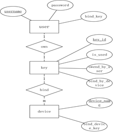

#### 设备密钥要求
每一个设备在出厂时必定对应一个设备密钥，也就是在用户注册前，设备密钥下就一定有已存在的设备，这是开发商人员应该进行预先设置的，以免用户通过密钥注册时无法连接任何设备节点。

## 移动应用
该模块旨在提供给用户提供直观、便捷的操作界面，使用户能够轻松控制家中的智能设备、获得实时的传感器数据、设置自动化任务等功能。通过移动应用程序，用户可以随时随地通过移动设备与整个智能家居系统进行交互。

## 云服务器
云服务器是一种基于云计算技术的服务器，可以提供各种计算、存储和网络服务，为用户提供灵活、可扩展的计算资源。

边缘计算模式中，云服务器的计算压力迁移到边缘设备附近，即边缘计算网关通常用于处理边缘设备产生的数据，然后传输数据到云服务器进行进一步处理。

阿里云物联网云平台是一款基于云计算技术的物联网平台，提供设备接入、数据采集、数据处理、远程控制等功能。该平台支持多种设备协议，可以轻松实现设备的接入和管理，同时提供了丰富的API和SDK，方便开发者进行二次开发。

## 配置流程
### 初始化配置
网关配置结构：网关本地IP地址、数据库服务器IP地址、网关与设备节点通信端口、网关与移动应用设备通信端口、网关与数据库服务器通信端口、本地数据库用户名、本地数据库密码、本地数据库库名。

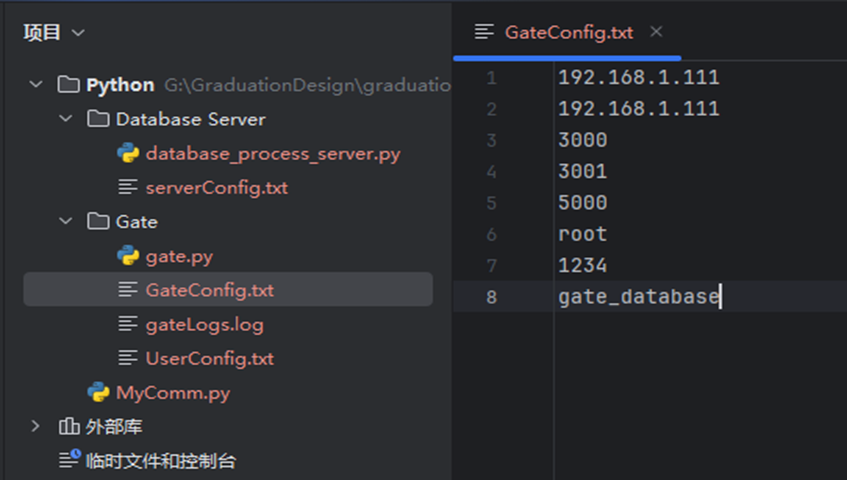

用户配置结构：用户名、密码、设备密钥。

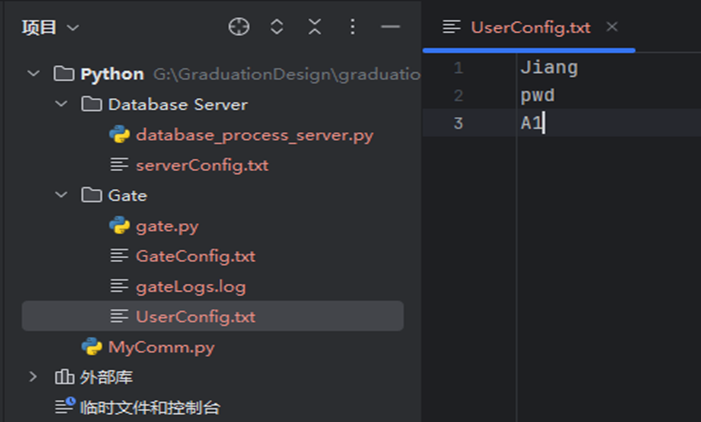

开发商服务器配置：服务器IP地址、服务器通信端口号。

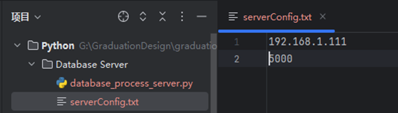

### 启动
#### 启动网关及数据库服务器
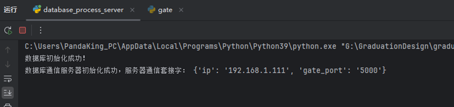

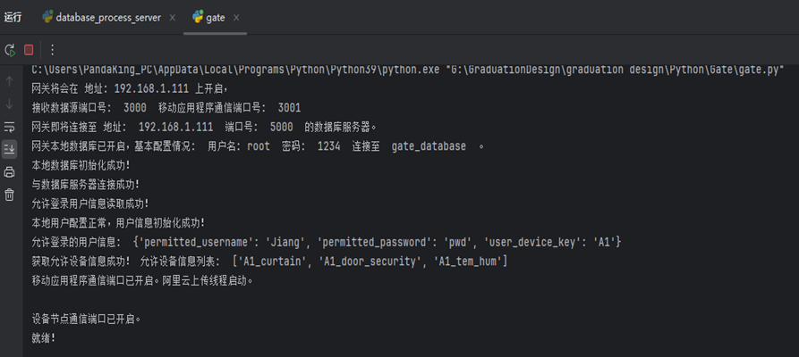

### 接入
设备通电

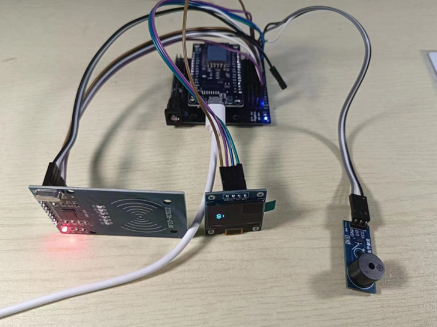

被允许的设备将接入网关

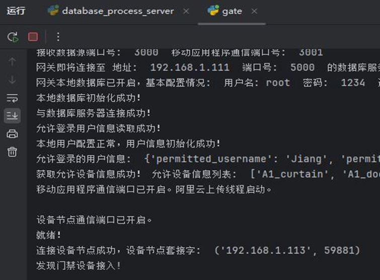

### 工作
若接入成功且门禁通过，则开始工作

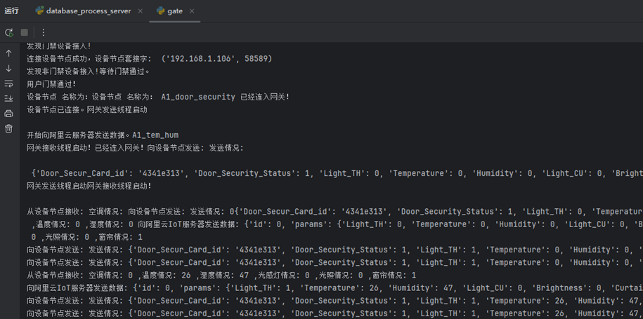

### 移动应用
#### 登录
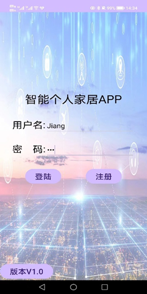

#### 注册
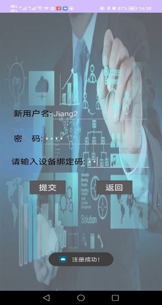

#### 控制
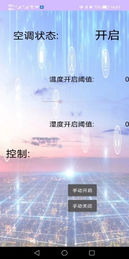

#### 历史记录
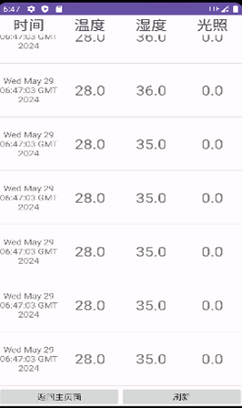

# 版本内容更新
###### v1.0.0